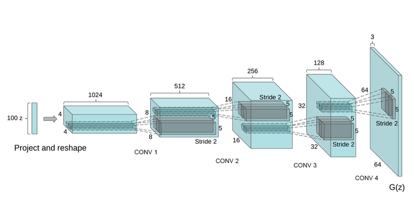

[](https://python.org)

# ML project description
A simple and well designed structure is essential for any Deep Learning project - **simplicity, best practice for folder structure**. 

Include your architecture image:
<p align="center">


</p>
<p align="center">
<em>Sample caption</em>
</p>


# Requirements
## Specification of dependencies
- [PyTorch](https://pytorch.org/) (An open source deep learning platform) 
- [ignite](https://github.com/pytorch/ignite) (High-level library to help with training neural networks in PyTorch)

If for some reason you choose not to use Anaconda, you must install the following frameworks and packages on your system:
* Python 3.7
* Pytorch x.x.x
* h5py
* python-socketio
* scikit-image

# Data
Provide a link to a downloadable version of the dataset or simulation environment. For new data collected, a description of the data collection process, such as instructions to annotators and methods for quality control (e.g, CVAT was used etc.).

# Experiment
In a nutshell here's how to use this project, so **for example** assume you want to implement ResNet-18 to train mnist, so you should do the following:
- In `modeling`  folder create a python file named whatever you like, here we named it `example_model.py` . In `modeling/__init__.py` file, you can build a function named `build_model` to call your model

```python
from .example_model import ResNet18

def build_model(cfg):
    model = ResNet18(cfg.MODEL.NUM_CLASSES)
    return model
``` 
   
- In `engine`  folder create a model trainer function and inference function. In trainer function, you need to write the logic of the training process, you can use some third-party library to decrease the repeated stuff.
## Training your Model
```python
# trainer
def do_train(cfg, model, train_loader, val_loader, optimizer, scheduler, loss_fn):
 """
 implement the logic of epoch:
 -loop on the number of iterations in the config and call the train step
 -add any summaries you want using the summary
 """
pass

# inference
def inference(cfg, model, val_loader):
"""
implement the logic of the train step
- run the tensorflow session
- return any metrics you need to summarize
 """
pass
```

- In `tools`  folder, you create the `train.py` .  In this file, you need to get the instances of the following objects "Model",  "DataLoader”, “Optimizer”, and config
```python
# create instance of the model you want
model = build_model(cfg)

# create your data generator
train_loader = make_data_loader(cfg, is_train=True)
val_loader = make_data_loader(cfg, is_train=False)

# create your model optimizer
optimizer = make_optimizer(cfg, model)
```
## Custom scores, loss functions
Please specify any custom metrics you use:


And how:
```python
def tversky_loss(beta):
  def loss(y_true, y_pred):
    numerator = tf.reduce_sum(y_true * y_pred, axis=-1)
    denominator = y_true * y_pred + beta * (1 - y_true) * y_pred + (1 - beta) * y_true * (1 - y_pred)

    return 1 - (numerator + 1) / (tf.reduce_sum(denominator, axis=-1) + 1)

  return loss
```
## Important details
For all reported experimental results, check if you include:
- The range of hyper-parameters considered, method to select the best hyper-parameter configuration, and specification of all hyper-parameters used to generate results.

# Project structure
You may find useful one of the ready-to-use file structure generators, if needed:

https://github.com/ramonmoraes/structure-generator

Or simply use
```
git ls-tree -r master --name-only
```
This repo has following directory structure:
```
.
├───code
│   ├───data_acquisition_exploration
│   ├───deployment
│   └───modelling
├───data
│   ├───exploration
│   ├───processed
│   └───raw
└───docs
    ├───data_reports
    |───final_reports
    └───project_reports
```

The data directory is organized as follows:
```
data/runs - contains the results of prediction runs
data/train/images - contains images for the training set
data/train/masks - contains masked (labeled) images for the training set
data/validation/images - contains images for the validation set
data/validation/masks - contains masked (labeled) images for the validation set
data/weights - contains trained models

data/raw_sim_data/train/run1
data/raw_sim_data/validation/run1
```

# Todo
-hyper parameter search template

# Citing

If you use this package in your publications or in other work, please cite it as follows:

```
@misc{ronneberger2015unet,
    title={U-Net: Convolutional Networks for Biomedical Image Segmentation},
    author={Olaf Ronneberger and Philipp Fischer and Thomas Brox},
    year={2015},
    eprint={1505.04597},
    archivePrefix={arXiv},
    primaryClass={cs.CV}
}
```
# Maintainer
Email, name
